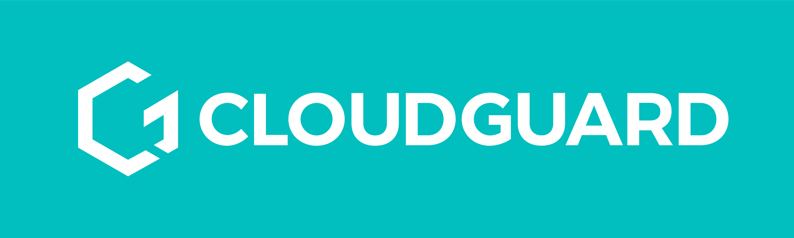

# CloudGuard One-Click deploy for Sentinel

[CloudGuard's](https://cloudguard.ai/) one click to deploy Azure Sentinel into your own environment. Simply click the button below and follow the instructions.

## Grocery List - Deployment Options

A few deployments available through Microsoft Sentinel To-go!

| Items | Deploy | 
| :---| :---| 
| [Microsoft Sentinel](https://github.com/cloudguardai/CloudGuard-Deploy/tree/master/microsoft-sentinel) |  |
| [Azure Lighthouse](https://github.com/cloudguardai/CloudGuard-Deploy/tree/master/deploy-lighthouse) |  |

## Credit
Developed largely from Roberto and his Sentinel2Go Repository.
* Roberto Rodriguez ([@Cyb3rWard0g](https://twitter.com/Cyb3rWard0g))

